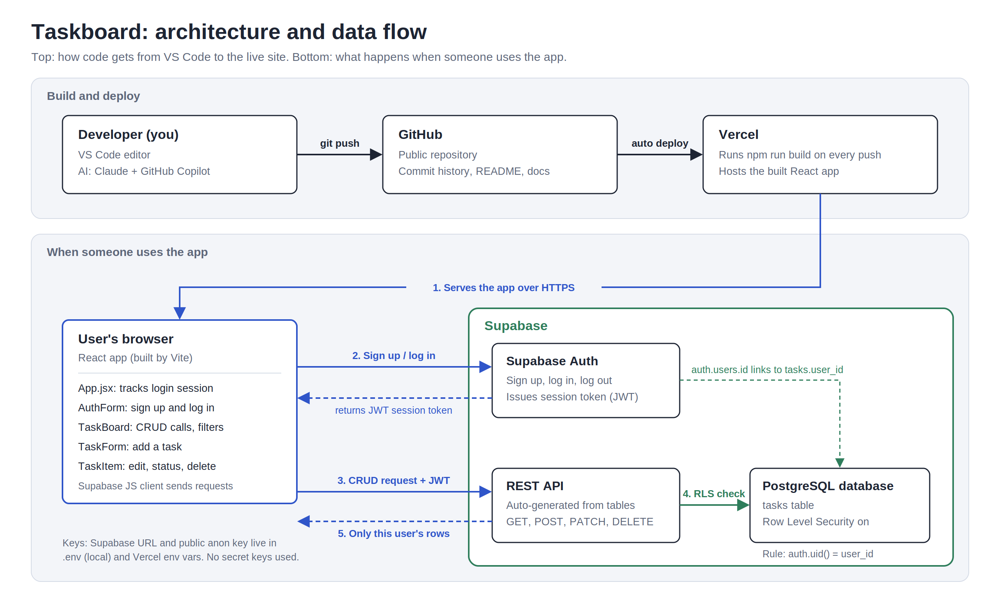

# Taskboard

A simple task manager web app. Users create an account, log in, and manage their own private list of tasks. Each task has a title, an optional due date, and a status (To do, In progress, Done). Built for the ED2 "Build Software with AI" assignment using AI coding tools.

**Status:** in development

## Planned technologies

- **Frontend:** React, Vite
- **Backend / Database:** Supabase (PostgreSQL and authentication)
- **Hosting:** Vercel
- **AI tools:** Claude, GitHub Copilot in VS Code
- **Version control:** Git and GitHub

## Planning documents

- [SPEC.md](SPEC.md) for features and acceptance criteria
- [docs/ARCHITECTURE.md](docs/ARCHITECTURE.md) for architecture, database schema, and data operations
- [AGENTS.md](AGENTS.md) for rules given to AI coding agents
